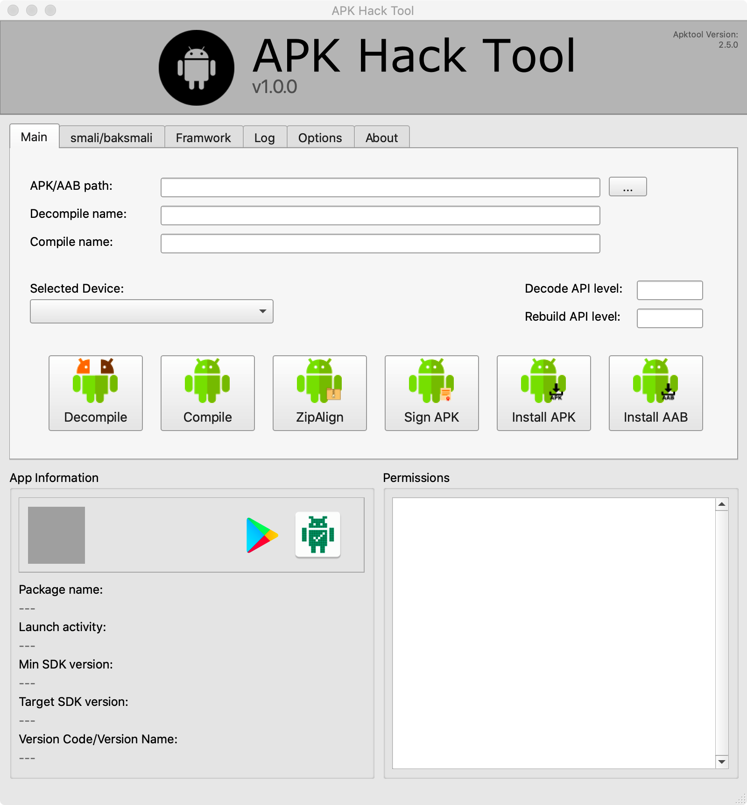
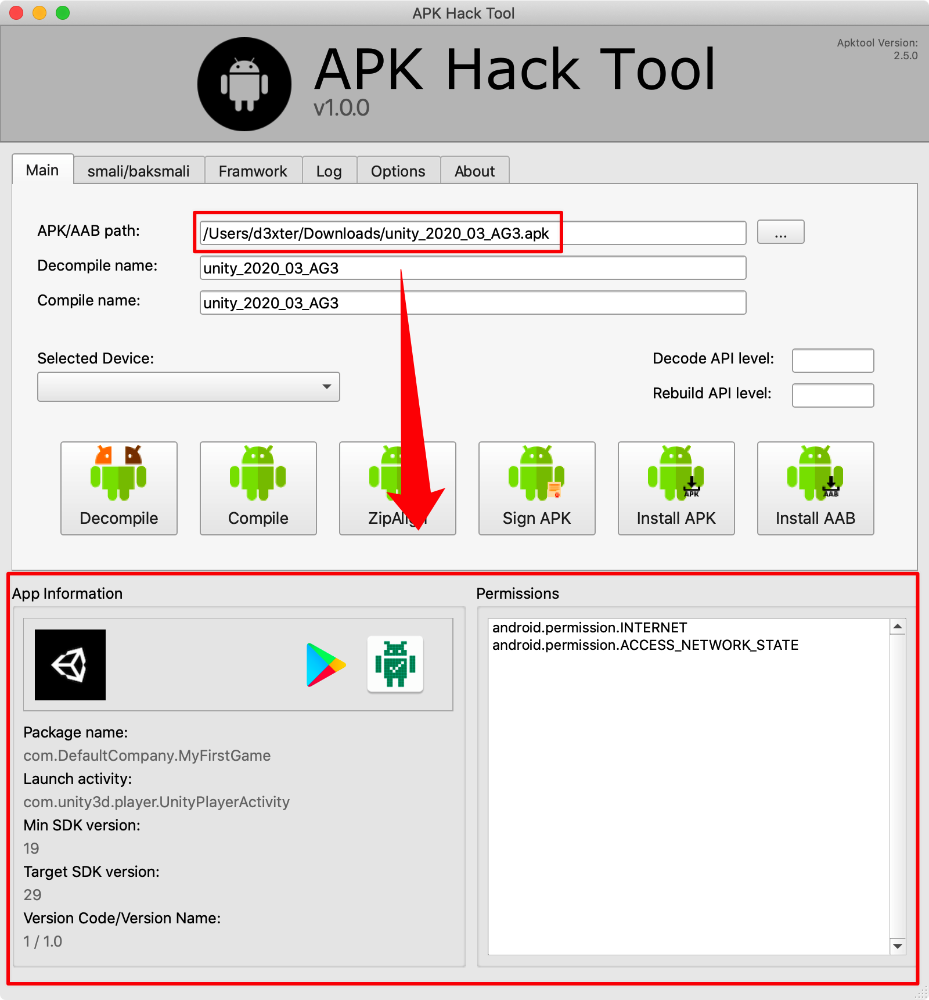
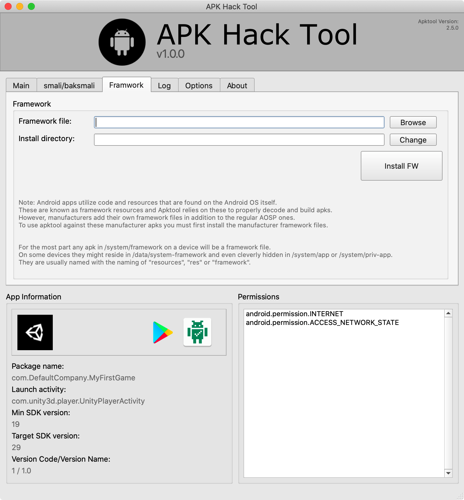
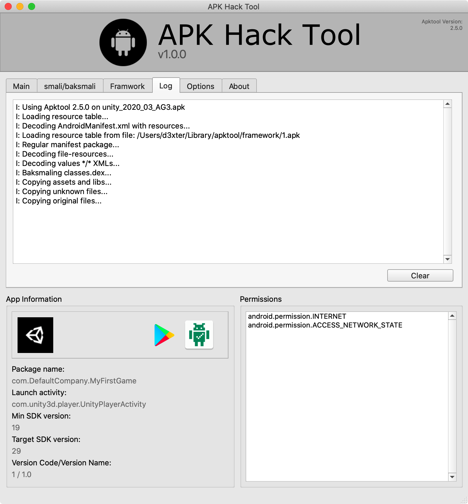
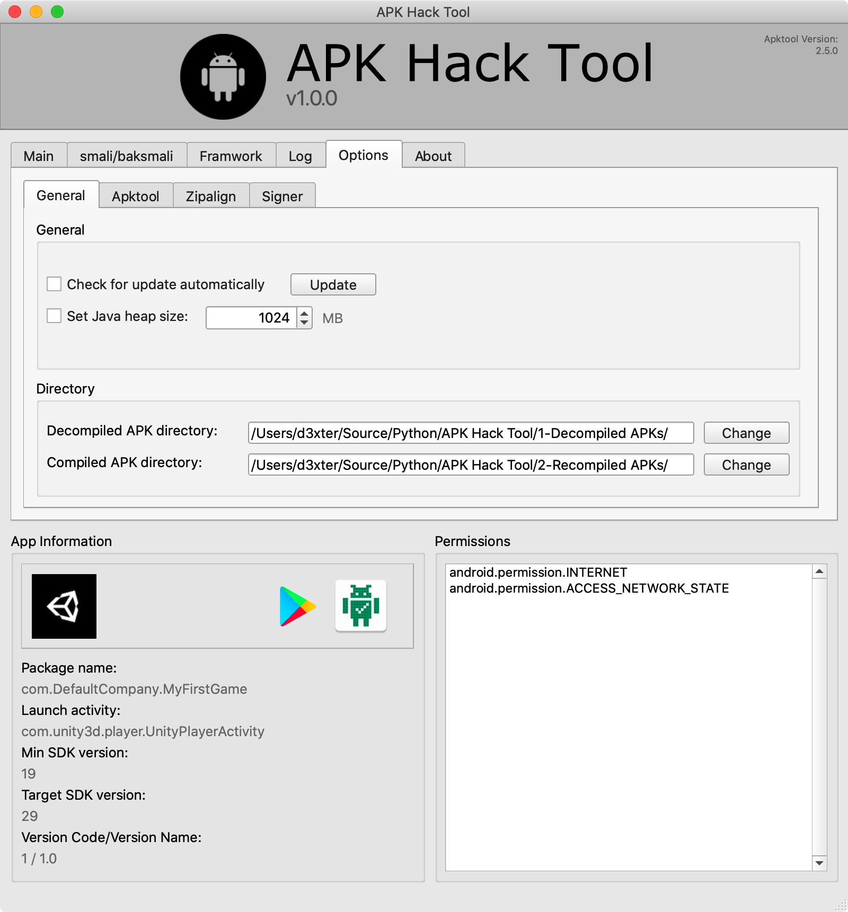
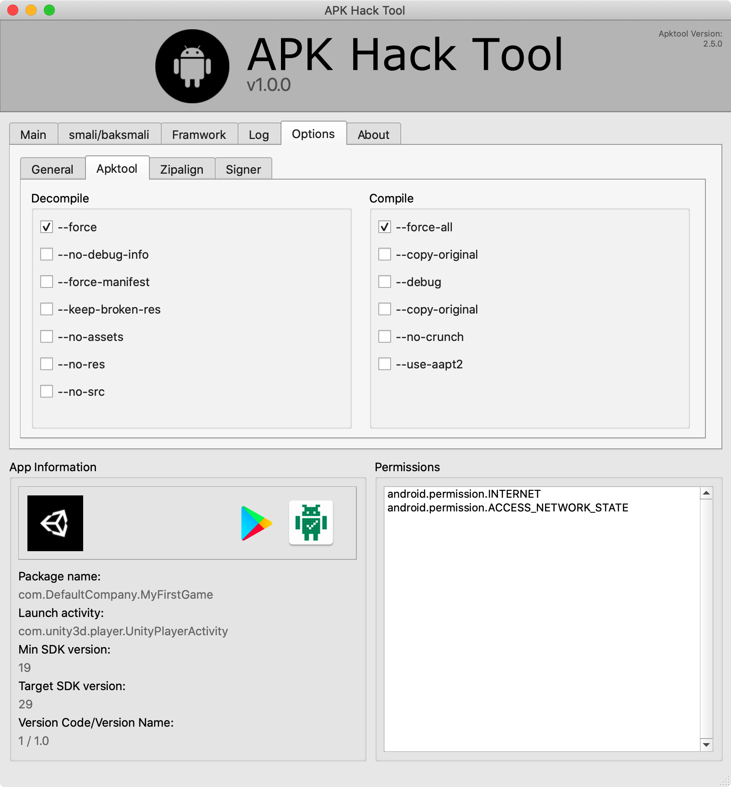
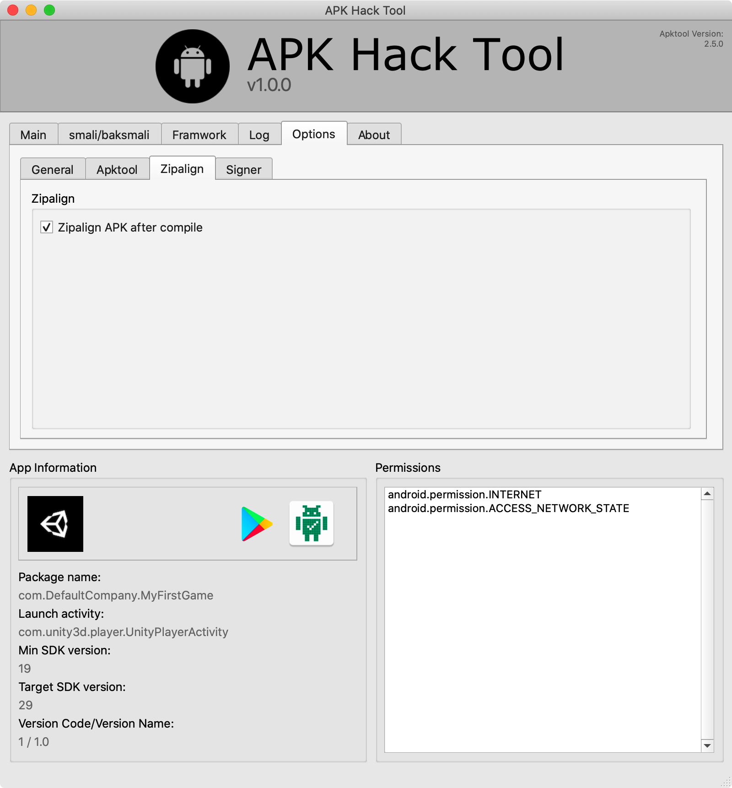
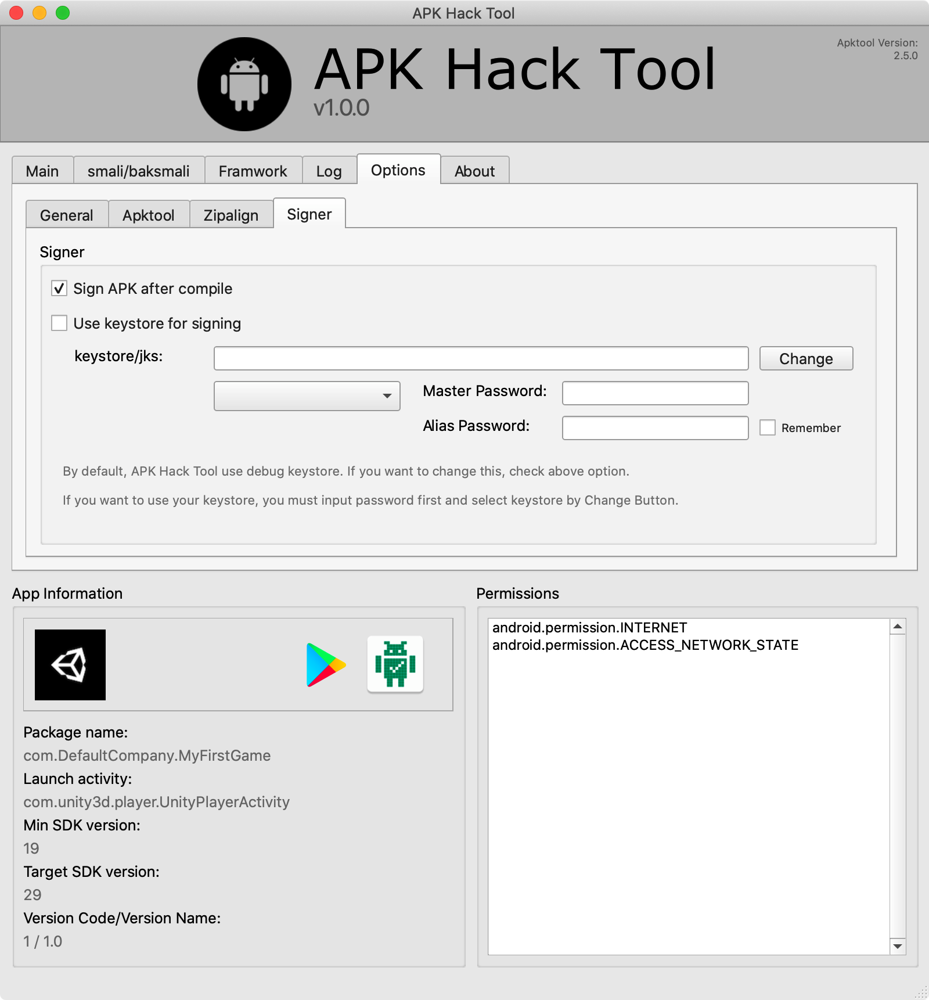

## APK Hack Tool 

APK Hack Tool is a GUI application that enables you to manage, sign, compile and decompile the APK and AAB files for hacking. It is a tool for reverse engineering Android apps. In Windows environment, there is a good tool called APK Easy Tool. However, there are no tools on macOS so it is optimized for macOS only.

In addition, APK Hack Tool also provides compile and decompile for the AppBundle. Many thanks to evildog1 because this tool is derived from the idea of APK Easy Tool.

#### APK Information
* Show APK or AAB information and link to PlayStore and APKCombo
* Show Permissions and link to Google Developer Manual (Double click)

#### Smali/Baksmali

#### Frameworks

* Install custom framwork and manage framwork paths

#### Log

### Options

If you find an issue or hava a idea with this tool, please send a note to d3xter0lab@gmail.com before opening a GitHub issue.

#### TODO
* [ ] Support AAB (AppBundle)
* [ ] Support save setting (such as keystore)
* [ ] Support auto update